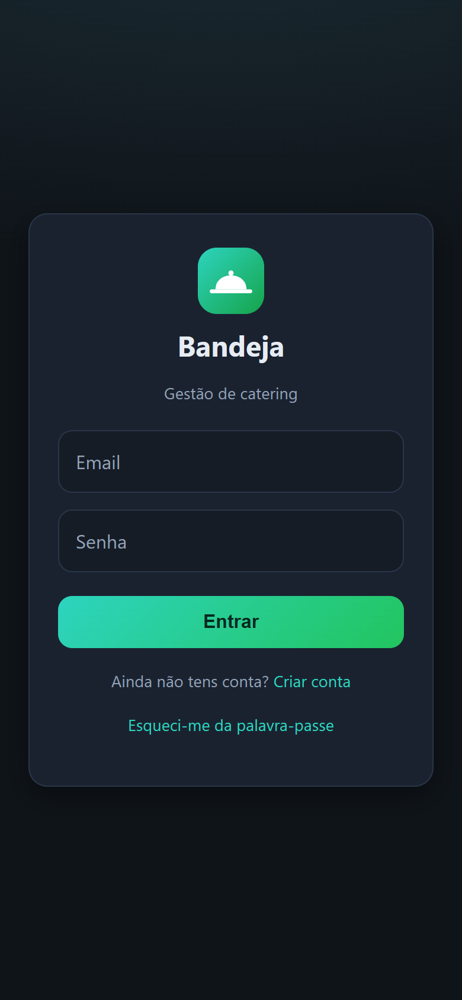
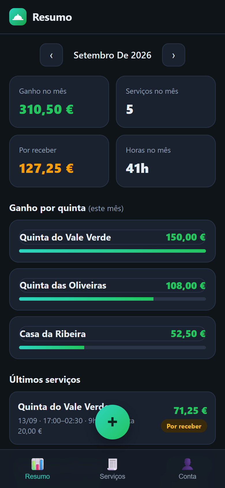
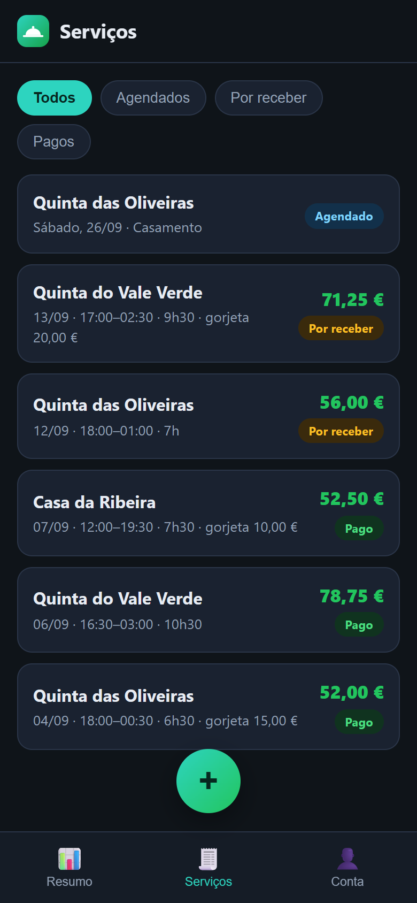
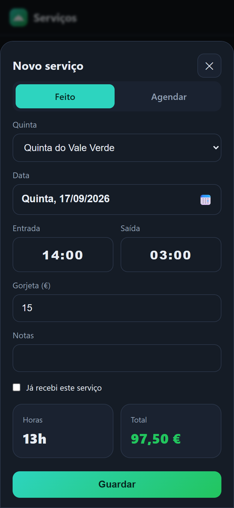

# Bandeja 🍽️

🔗 **Live demo:** [bandejacatering.netlify.app](https://bandejacatering.netlify.app)

> **Note:** this is a demo instance. Signing up creates a real account in the database.

**Bandeja** is a mobile-first Progressive Web App for catering staff who work shifts at wedding and event venues. It tracks every service worked, calculates hours and earnings automatically (including overnight shifts), keeps tips separate, and shows at a glance what each venue still owes.

The interface is in European Portuguese (pt-PT). Data is stored in [Supabase](https://supabase.com) and synced across phone and desktop, with an offline fallback.

## Screenshots

<p>
  
  
  
  
</p>

_Screenshots show fictional sample data._

## Features

**Accounts**
- Sign up with name, surname, optional phone number, username and email (validated)
- Log in with email and password, with generic error messages that don't reveal whether an account exists
- Password reset by email and password change from the account page
- Editable profile (view / edit mode); the username is shown in the app but is not used to log in

**Monthly summary**
- Earnings, amount still to be received, hours worked and number of services for the selected month
- Month-by-month navigation
- Earnings per venue with proportional bars, plus the most recent services

**Services**
- Log a completed service: venue, date, start and end time, tip, notes, paid / unpaid
- Hours and totals are calculated automatically, including shifts that end after midnight
- The hourly rate is stored with each service, so changing a venue's rate later doesn't alter past records
- **Scheduled services**: book a venue for a future date; when you later log a completed service for the same venue and day, the scheduled entry is completed instead of duplicated
- Filters: all, scheduled, unpaid, paid, with an "owed per venue" breakdown for unpaid services
- One tap on the status badge toggles paid / unpaid
- Smart defaults: the venue's usual start time, the current time rounded to 15 minutes, and the previous day's date when logging in the early morning (before 8:00)
- Custom iOS-style time picker (15-minute steps with a "Now" shortcut) and calendar date picker

**Venues**
- Create, edit and delete venues with hourly rate, usual start time and notes
- Save a venue's GPS location; when adding a service, the app detects which saved venue you are at (within 1 km)

**Account statistics**
- All-time earnings, hours, services and pending amounts, broken down per venue
- Tips list with monthly and all-time totals

**PWA and offline**
- Installable on iOS and Android home screens (manifest and icons)
- Service worker caches the app shell (network first, cache fallback)
- The last loaded data is cached locally and shown when there is no connection

## Tech stack

- **Frontend:** vanilla HTML, CSS and JavaScript (no framework, no build step)
- **Backend:** [Supabase](https://supabase.com) (PostgreSQL, Auth and Row Level Security)
- **Client library:** [`@supabase/supabase-js` v2](https://github.com/supabase/supabase-js), loaded from the jsDelivr CDN
- **PWA:** Web App Manifest, Service Worker, Geolocation API and `localStorage`

## Project structure

| File | Purpose |
|---|---|
| `index.html` | App markup (login, views, modals) |
| `styles.css` | Styles (dark theme, mobile-first) |
| `app.js` | App logic: auth, data loading, rendering, calculations, pickers, geolocation |
| `config.js` | Supabase project URL and anon key |
| `supabase_schema.sql` | Database tables, indexes, RLS policies, profile trigger and functions |
| `sw.js` | Service worker (offline support) |
| `manifest.json`, `icon.svg`, `icon-*.png`, `apple-touch-icon.png` | PWA manifest and icons |

## Running locally

The app is a static site, so any static file server works. With Node.js installed:

```bash
npx serve .
```

Then open the URL shown in the terminal (usually `http://localhost:3000`).

> Serve the files over HTTP rather than opening `index.html` directly: the service worker only registers on `http(s)://` origins.

To deploy it, upload the folder to any static host (Netlify, Vercel, GitHub Pages, …).

## Supabase setup

To run the app against your own backend:

1. **Create a project** at [supabase.com](https://supabase.com).
2. **Create the schema:** open **SQL Editor → New query**, paste the contents of [`supabase_schema.sql`](supabase_schema.sql) and run it. This creates:
   - `quintas` (venues), `servicos` (services) and `profiles` tables, with indexes
   - **Row Level Security** on every table, with policies that only let users read and write their own rows (`auth.uid() = user_id`)
   - a trigger that creates a profile when a user signs up
   - **server-side validation**: the database itself enforces length limits, formats and valid values (for example, no negative amounts), and a service can only reference one of the user's own venues. The app applies the same limits in its forms.

   The script contains no functions callable by unauthenticated clients. It also removes the old `email_do_username` function, if it exists. It can be run again on an existing database: it only adds what is missing and doesn't delete data.
3. **Configure the client:** in **Project Settings → API**, copy the project URL and the `anon` public key, then edit `config.js`:

   ```js
   window.APP_CONFIG = {
     SUPABASE_URL: "https://your-project-ref.supabase.co",
     SUPABASE_ANON_KEY: "your-anon-public-key",
   };
   ```

4. **Configure Authentication** (see below).

### Recommended Authentication settings

These settings keep sign-ups open while limiting abuse:

| Setting | Where | Recommendation |
|---|---|---|
| Custom SMTP | Authentication → Emails → SMTP Settings | Use your own provider (e.g. Resend, Brevo). Supabase's built-in email service is heavily rate-limited and meant for testing only. |
| Confirm email | Authentication → Sign In / Providers → Email | **On.** Users can't register with someone else's email, and sign-up responses no longer reveal whether an email is already registered. |
| Site URL and Redirect URLs | Authentication → URL Configuration | Add the deployed URL; the confirmation and password-reset links redirect there. |
| Minimum password length | Authentication → Sign In / Providers → Email | 8 or more characters (update the `minlength` attributes and messages in the app to match). |
| Secure email change | Authentication → Sign In / Providers → Email | On. |
| Rate limits | Authentication → Rate Limits | Keep the defaults, or lower sign-ups per IP. |
| CAPTCHA | Authentication → Attack Protection | Optional (e.g. Cloudflare Turnstile). **Requires app changes first:** a `captchaToken` must be sent with `signUp`, `signInWithPassword` (including the current-password check when changing password) and `resetPasswordForEmail`, otherwise every login will fail. |

### About the key in `config.js`

The `anon` key committed in `config.js` is **public by design**. It ships to every browser that loads the app and only grants the permissions of an unauthenticated client. User data is protected by the **Row Level Security** policies in `supabase_schema.sql`, not by keeping this key secret.

Never put the `service_role` key (or any other secret) in this file.

If you fork this project, replace the values in `config.js` with your own project's, so your users are created in your own Supabase project.

## License

Released under the [MIT License](LICENSE).
